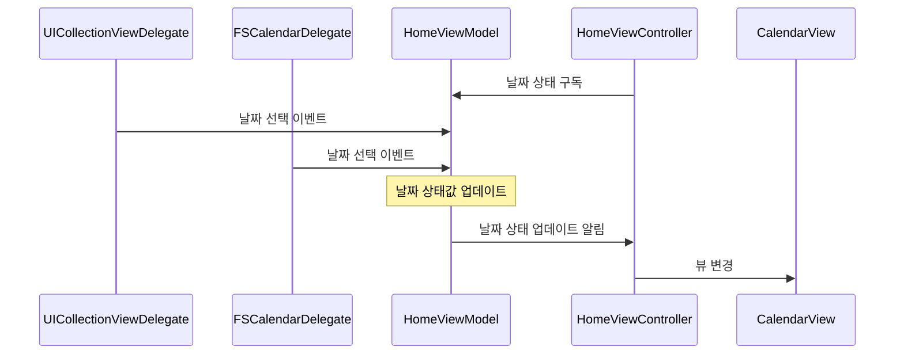
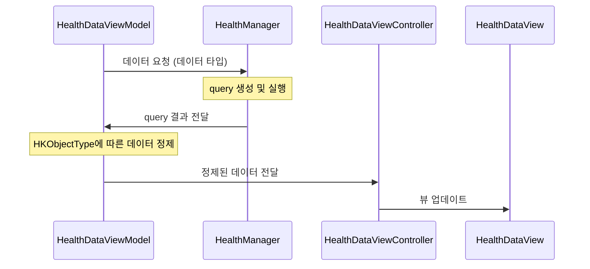
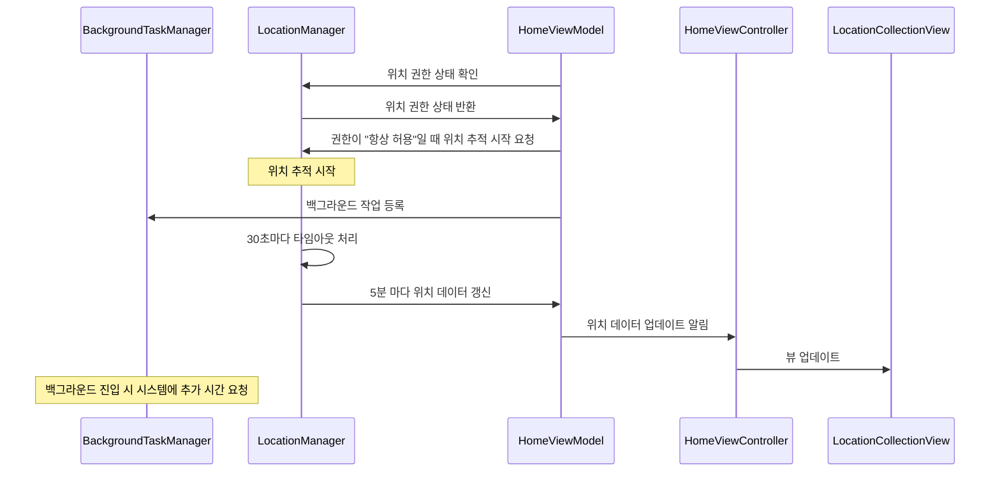

## 1. CalendarView
> 수평 스크롤 방식의 날짜 선택 UI 컴포넌트를 구현한다. 날짜를 탐색하고 선택할 수 있다.


### CalendarView를 스크롤할 때 셀 영역에 맞추어 멈추게 하기 (페이지처럼)

- **`UICollectionViewFlowLayout targetContentOffset(forPropersedContentOffset:)`**
- 스크롤 애니메이션이 끝날 때 멈출 것으로 예상되는 콘텐츠 오프셋 값(proposedContentOffset)을 가지고 **가장 가까운 셀을 찾은 후, 스크롤 방향에 따라 적절한 값으로 계산하여 리턴**한다.
    
    ```swift
    override func targetContentOffset(
        forProposedContentOffset proposedContentOffset: CGPoint,
        withScrollingVelocity velocity: CGPoint
    ) -> CGPoint {
        // proposedContentOffset(예상 지점)을 가지고 가장 가까운 셀을 찾는다.
        // 정확한 셀을 찾기 위해 스크롤 방향에 따라 적절한 값으로 계산한다.
        // 예시1: 왼쪽으로 스크롤 중이고, 멈출 것으로 예상되는 지점이 6번째 셀의 중간이라면, 6번째 셀로 결정
        // 예시2: 오른쪽으로 스크롤 중이고, 멈출 것으로 예상되는 지점이 6번째 셀의 중간이라면, 7번째 셀로 결정
    }
    ```
    

## 2. FSCalendar
> FSCalendar 라이브러리를 CalendarView와 연동하여, 선택된 날짜를 서로 바인딩할 수 있다.


### 날짜를 선택하는 모든 케이스

- **`UICollectionViewDelegate collectionView(_:didSelectItemAt:)`**
    - CalendarView의 셀을 선택할 때
- **`FSCalendarDelegate calendar(_:didSelect:at)`**
    - FSCalendar의 셀을 선택할 때

### 데이터 바인딩



## 3. Fetching Data with HealthKit
> CalendarView의 선택된 날짜에 해당하는 건강 데이터(걸음 수, 이동거리, 수면 시간, 심박수)를 화면에 표시할 수 있다.

|||||
|-|-|-|-|


### 건강 데이터 권한 얻기

- Capabilities 추가 필요


- Info.Plist에 **`Privacy - Health Share Usage Description`** 필드 필요
- **`healthStore.requestAuthorization(toShare:read:)`**
    - 읽고 싶은 데이터에 대한 권한 요청

### 건강 데이터 읽기

- **`HKSampleQuery(sampleType:predicate:limit:sortDescriptors:)`**
    - sampleType: 검색할 샘플 유형
        - quantity(숫자값으로 저장 가능한 데이터): stepCount, distanceWalkingRunning, heartRate
        - category(유한한 카테고리로 나눌 수 있는 데이터): sleepAnalysis
    - predicate: 쿼리에서 반환회는 결과를 제한하는 술어(날짜 제한 가능)
- **`healthStore.execute(query)`**
    - 쿼리 실행

> 🫢
**읽기 권한**
공식 문서에 의하면 앱은 읽기 권한 허용 여부를 직접 알 수 없다. 만약 읽기 권한이 거부되었다면 앱은 HealthKit store에서 자신이 저장한 데이터만을 읽을 수 있다. 즉, 다른 앱(또는 사용자가 수동으로 입력한 데이터 등)이 저장한 데이터에는 접근할 수 없다.
[Authorizing access to health data | Apple Developer Documentation](https://developer.apple.com/documentation/healthkit/authorizing_access_to_health_data)


### 데이터 바인딩



## 4. KeepAlive App
> 5분마다 날짜, 위치(위도, 경도) 데이터를 화면에 표시할 수 있다. 단, 앱이 최대한 꺼지지 않아야 한다.


### 백그라운드 작업 가능하게 하기

- Capabilities 추가 필요
  

- **`UIApplication.shared.beginBackgroundTask`**
    - 앱이 백그라운드에 진입할 때 백그라운드 작업을 시작하는 메서드
        - “중요한 작업을 하고 있으니 종료하지 말아주세요”
    - 클로저로 백그라운드 작업이 끝났을 때 실행할 코드블럭을 전달

### 위치 권한 얻기

- Info.Plist에 **`Privacy - Location When In Use Usage Description`** 필드 필요
- Info.Plist에 **`Privacy - Location Always and When In Use Usage Description`** 필드 필요
- **`CLLocationManagerDelegate locationManagerDidChangeAuthorization(_)`**
    - 위치 권한이 바뀔 때 호출되므로 권한 상태에 따라 알맞은 처리 필요
    - KeepAlive 앱의 경우 백그라운드에서도 위치 수집을 해야 하기 때문에 “항상 허용” 필요

### 위치 데이터 얻기

- **`CLLocationMangerDelegate locationManager(_:didUpdateLocations)`**
    - 위치 정보를 올바르게 수집했을 때 호출됨
- **`CLLocationManagerDelegate locationManager(_,didFailWithError)`**
    - 위치 정보를 올바르게 수집하지 못 했을 때 호출됨

### 백그라운드에서 위치 정보를 수집하기 위한 장치

- **`locationManager.allowsBackgroundLocationUpdates = true`**
    - 백그라운드에서도 위치 업데이트를 받을 수 있도록 설정 (위치 권한 상태가 “항상 허용”이어야 함)
- **`locationManager.pausesLocationUpdatesAutomatically = false`**
    - 위치 업데이트가 자동으로 중지되는 것을 방지
- 타임아웃 기반 위치 요청 재시도
    - 지하철 등 위치 데이터를 얻기 어려운 환경에서는 위치 업데이트가 실패하거나 오랜 시간 동안 위치를 수신하지 못할 가능성이 있음
    - 이를 방지하기 위해 타이머를 활용하여 30초 동안 위치 업데이트가 없을 경우 위치 업데이트를 재요청하는 로직 구현
    
    ```swift
    private func startLocationTimeout() {
        locationTimer?.invalidate()
        locationTimer = Timer.scheduledTimer(
            withTimeInterval: Constants.locationTimeout,
            repeats: false
        ) { [weak self] _ in
            self?.handleLocationTimeout()
        }
    }
        
    private func handleLocationTimeout() {
        lastError = "타임아웃, 재시도합니다."
        stopUpdatingLocation()
        requestLocationUpdates() // 다시 시도
    }
    ```
    

### 플로우


